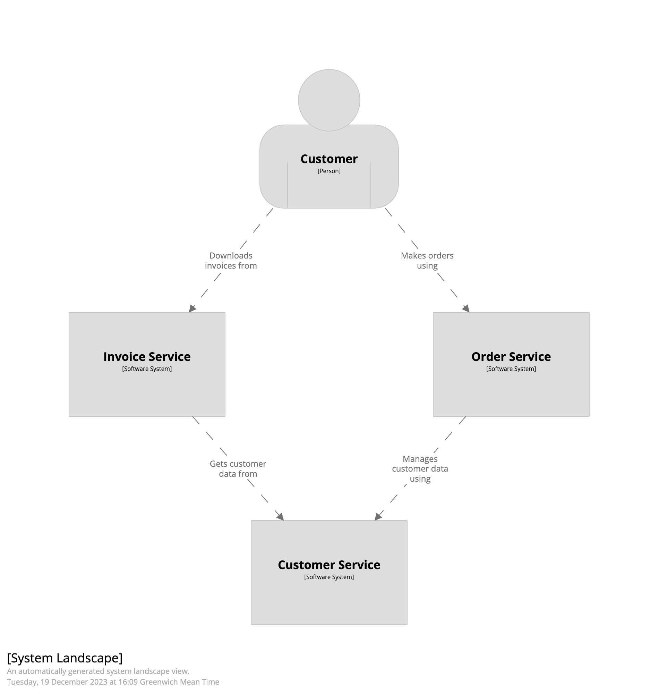

# Enterprise-wide modelling with Structurizr

This Java project contains a number of examples of how to approach enterprise-wide modelling with the Structurizr tooling.

- Example 1: Enterprise modelling with the Structurizr DSL
- Example 2: Backstage as a system catalog + Structurizr DSL
- Example 3: Backstage to Structurizr

## Example 1

This example use a combination of the Structurizr on-premises installation, Structurizr DSL, and the Structurizr for Java library.
There are 3 software system scoped workspaces, each defined using the Structurizr DSL,
which are perhaps owned and maintained by 3 separate teams:

- [customer service](src/main/resources/example1/customer-service/workspace.dsl)
- [invoice service](src/main/resources/example1/invoice-service/workspace.dsl)
- [order service](src/main/resources/example1/order-service/workspace.dsl)

All people and software systems used across the enterprise are defined in a [system catalog workspace](src/main/resources/example1/system-catalog.dsl),
again defined using the Structurizr DSL. Note that this system catalog doesn't define any relationships.
Each of the software system scoped workspaces `extends` this system catalog, and adds detail for that one specific
software system via the `!extend` keyword.

The code in the [Example1 class](src/main/java/org/example/Example1.java):

1. Starts up a Structurizr on-premises installation (via Docker)
2. Loads the 3 example workspaces (above).
3. Automatically generates a system landscape diagram by extracting relationships from the 3 example workspaces.

To run this (you will need Java 17 and Docker installed):

```
./gradlew run -PmainClass=org.example.Example1
```

Here are the resulting diagrams:

| Customer service system context                                                           | Invoice service system context                                                        | Order service system context                                                     | System landscape (generated)                               |
|-------------------------------------------------------------------------------------------|---------------------------------------------------------------------------------------|----------------------------------------------------------------------------------|------------------------------------------------------------|
| [](images/customer-service.png)  | [](images/invoice-service.png) | [](images/order-service.png)  | [](images/landscape.png) |

## Example 2

- https://engineering.atspotify.com/2022/07/software-visualization-challenge-accepted/
- https://backstage.io/docs/features/software-catalog/system-model/
- https://demo.backstage.io

## Example 3

- https://engineering.atspotify.com/2022/07/software-visualization-challenge-accepted/
- https://backstage.io/docs/features/software-catalog/system-model/
- https://demo.backstage.io

